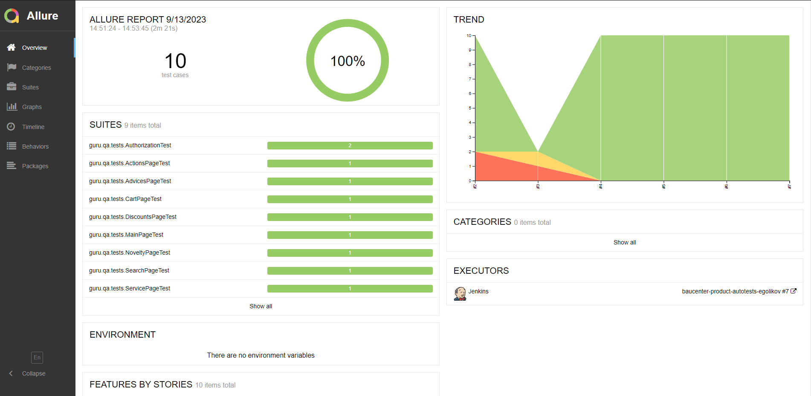
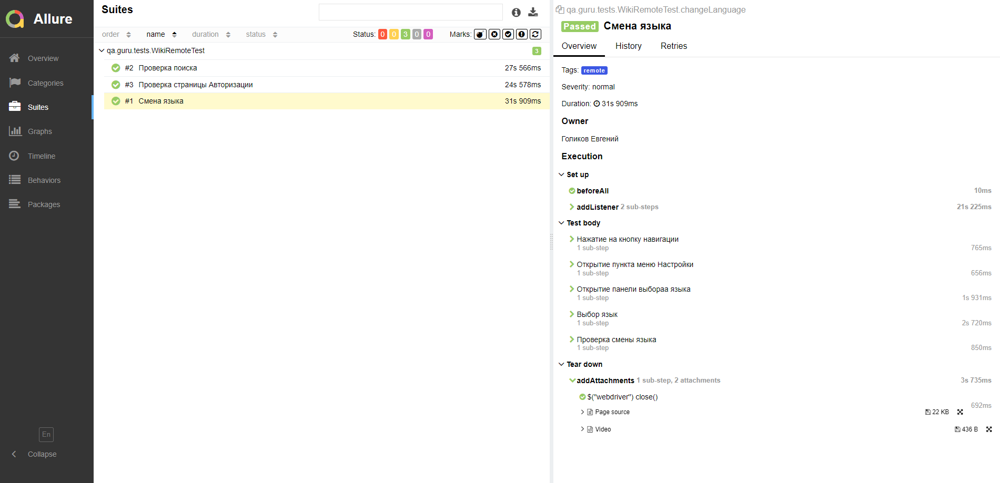
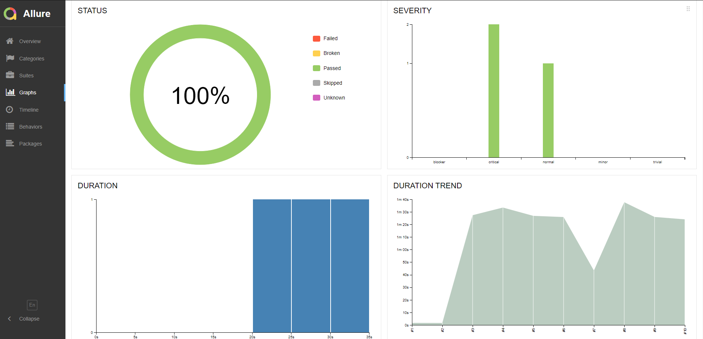
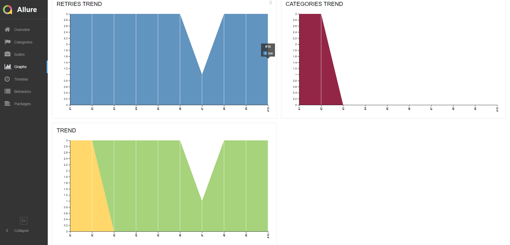
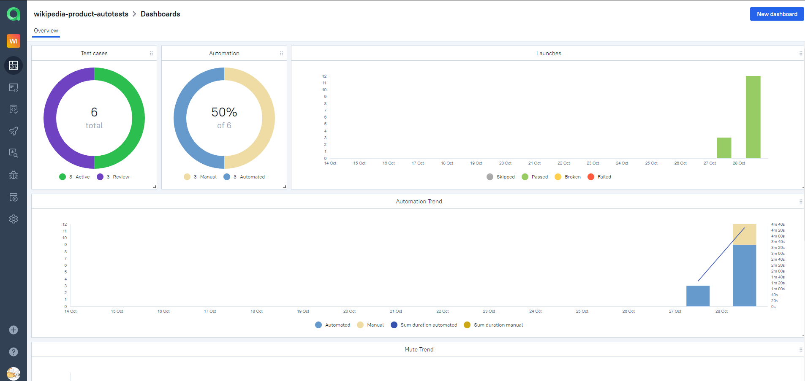
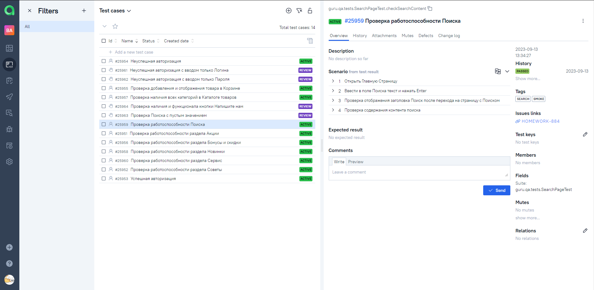
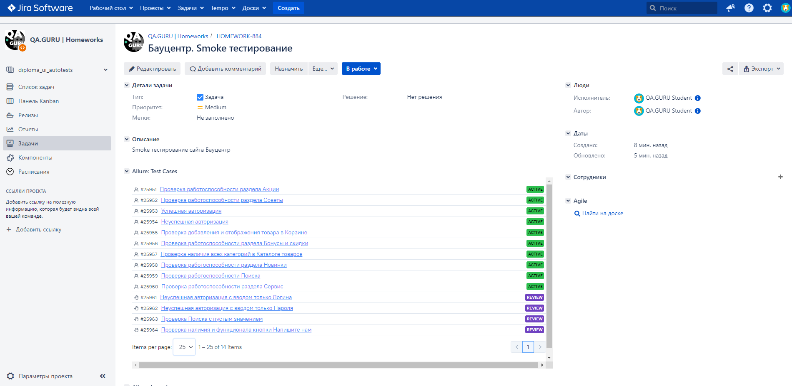
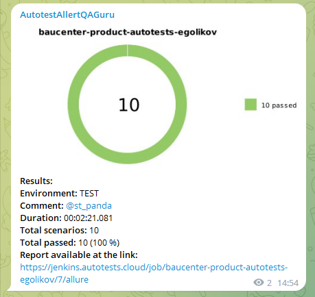
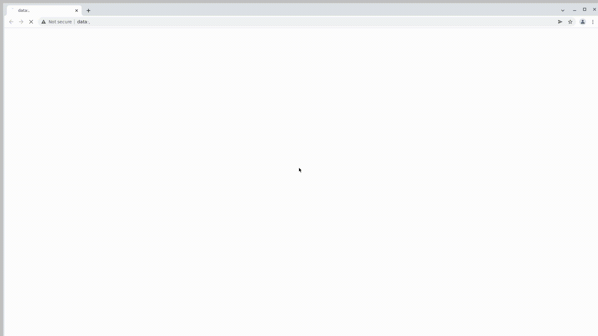

<h1 >Проект по автоматизации тестирования мобильного приложения <a href="https://github.com/wikimedia/apps-android-wikipedia/">Wikipedia</a></h1>

<p align="center">  
</a>  
</p>

# 🧾 Содержание:

- Технологии и инструменты
- Список проверок, реализованных в автоматизированных тест-кейсах
- Запуск тестов (Сборка в Jenkins)
- Запуск тестов (Из терминала)
- Allure-отчет
- Интеграция с Allure TestOps
- Интеграция с Jira
- Уведомление в Telegram о результатах выполнения автоматизированных тестов
- Видеопример прохождения тестов Browserstack

<a id="tools"></a>

## 🔨 Технологии и инструменты:

| Java                                                                                                     | IntelliJ  <br>  Idea                                                                                               | GitHub                                                                                                     | JUnit 5                                                                                                           | Gradle                                                                                                     | Selenide                                                                                                         | Selenoid                                                                                                                  | Allure <br> Report                                                                                                         | Jenkins                                                                                                          | Jira                                                                                                                                    | Telegram                                                                                                            |                                                                                            Allure <br> TestOps | Appium                                                                                                    | Browserstack                                                                                                                    |
|:---------------------------------------------------------------------------------------------------------|--------------------------------------------------------------------------------------------------------------------|------------------------------------------------------------------------------------------------------------|-------------------------------------------------------------------------------------------------------------------|------------------------------------------------------------------------------------------------------------|------------------------------------------------------------------------------------------------------------------|---------------------------------------------------------------------------------------------------------------------------|----------------------------------------------------------------------------------------------------------------------------|------------------------------------------------------------------------------------------------------------------|-----------------------------------------------------------------------------------------------------------------------------------------|---------------------------------------------------------------------------------------------------------------------|---------------------------------------------------------------------------------------------------------------:|-----------------------------------------------------------------------------------------------------------|---------------------------------------------------------------------------------------------------------------------------------|
| <a href="https://www.java.com/"></a> | <a href="https://www.jetbrains.com/idea/"></a> | <a href="https://github.com/"></a> | <a href="https://junit.org/junit5/"></a> | <a href="https://gradle.org/"></a> | <a href="https://selenide.org/"></a> | <a href="https://aerokube.com/selenoid/"></a> | <a href="https://github.com/allure-framework"></a> | <a href="https://www.jenkins.io/"></a> | <a href="https://www.atlassian.com/software/jira/"></a> | <a href="https://web.telegram.org/"></a> | <a href="https://qameta.io/"></a> | <a href="https://appium.io//"></a> | <a href="https://www.browserstack.com/"></a> |

<a id="cases"></a>

## 🏁 Реализованные проверки:

- Авторизация (Успешная, Неуспешная)
- Поиск на сайте
- Добавление и отображение товара в Корзине
- Наличие всех категорий в Каталоге товаров
- Работоспособность разделов: Акции, Новинки, Бонусы и скидки, Сервис, Советы

##  Сборка в [Jenkins](https://jenkins.autotests.cloud/job/baucenter-product-autotests-egolikov/)

<p align="center">  
</a>  
</p>

## 📋 Параметры сборки в Jenkins:

- _STAND_BASE_URL (URL Сайта, по умолчанию baucenter.ru)_
- _SELENOID_BASE_URL (URL Selenoid, по умолчанию selenoid.autotests.cloud)_
- _TASK (Задачи, по умолчанию Smoke_test)_
- _BROWSER (Браузер, по умолчанию chrome)_
- _BROWSER_VERSION (Версия браузера, по умолчанию 100.0)_
- _BROWSER_SIZE (Размер окна браузера, по умолчанию 2560x1440)_

## 🚀 Команда для запуска автотестов из терминала

Удаленный запуск с использованием Jenkins и Selenoid (требуется логин и пароль):

```bash  
gradle clean test -Denv=remote
```

##  </a>Интеграция с <a target="_blank" href="https://jenkins.autotests.cloud/job/baucenter-product-autotests-egolikov/7/allure/">Allure Report</a>

## 🖨️ Основная страница отчёта

<p align="center">  
  
</p>  

## 📄 Тест-кейсы

<p align="center">  
   
</p>

## 📊 Графики

<p align="center">   
  
  
</p>

##  </a>Интеграция с <a target="_blank" href="https://allure.autotests.cloud/project/3669/dashboards">Allure TestOps</a>

## 🖨️ Основная страница отчёта

<p align="center">  
  
</p>  

## 📄 Авто и Ручные тест-кейсы

<p align="center">  
  
</p>

## </a> Интеграция с <a target="_blank" href="https://jira.autotests.cloud/browse/HOMEWORK-884">Jira</a>

<p align="center">  
  
</p>

____

## </a> Уведомление в Telegram при помощи бота

____
<p align="center">  
  
</p>

____

## </a> Видеопример выполнения теста на Selenoid

____
<p align="center">
   
</p>

