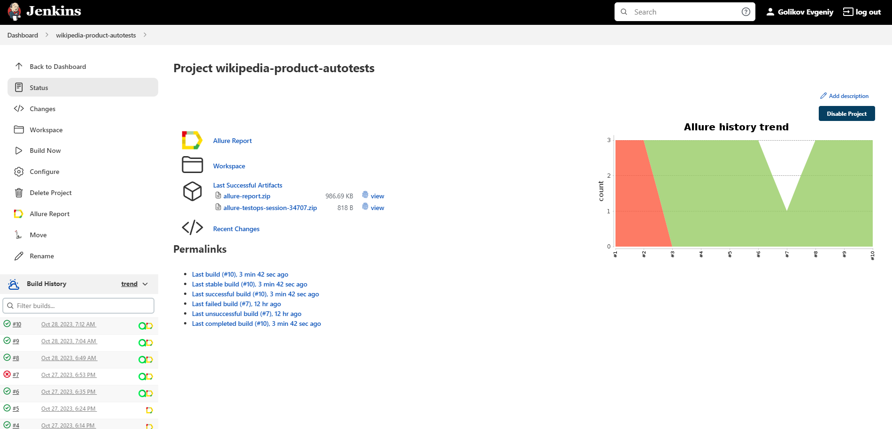
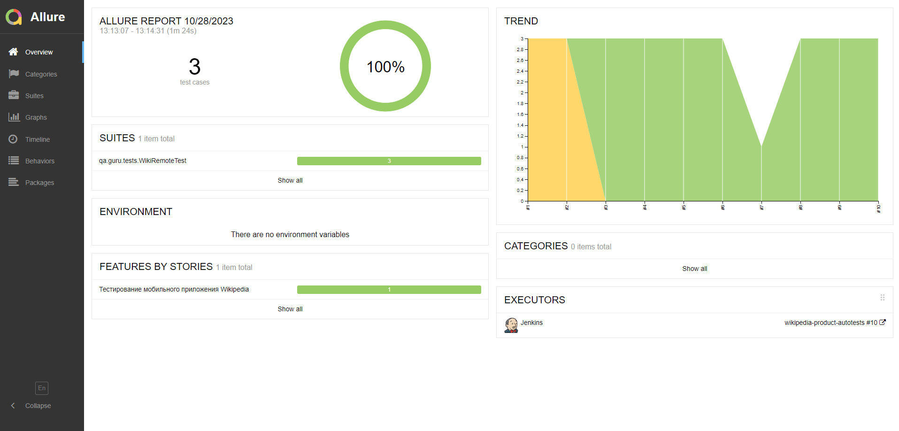
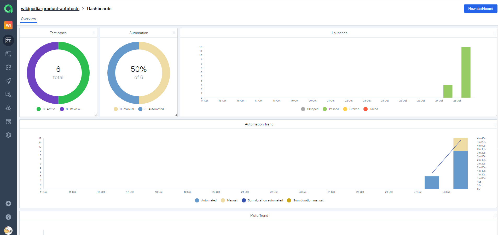
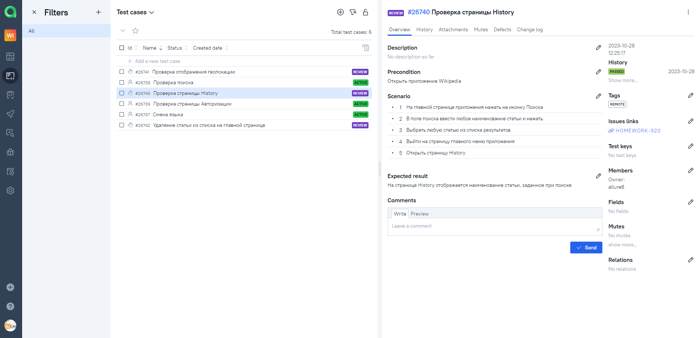
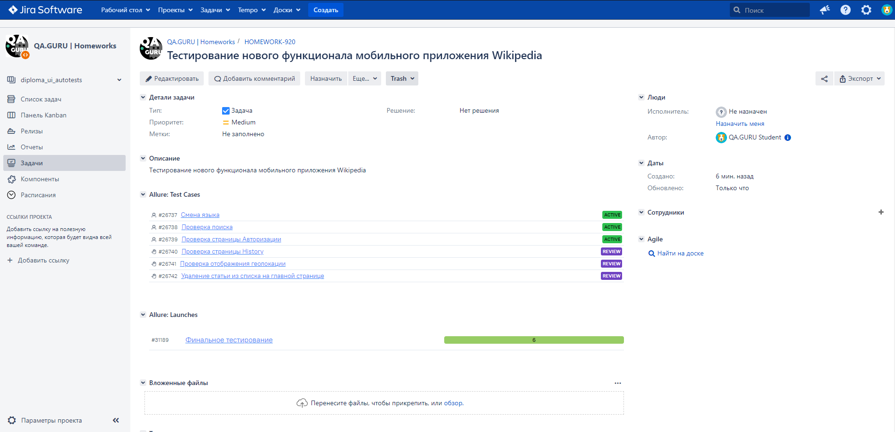
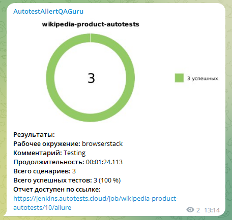
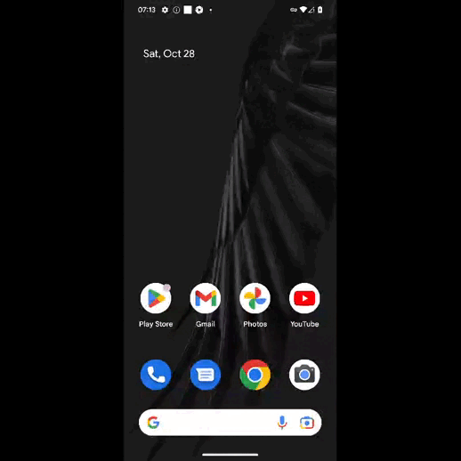

<h1 >Проект по автоматизации тестирования мобильного приложения <a href="https://github.com/wikimedia/apps-android-wikipedia/">Wikipedia</a></h1>

<p align="center">  
</a>  
</p>

# 🧾 Содержание:

- [Технологии и инструменты](#технологии-и-инструменты)
- [Реализованные проверки](#Реализованные-проверки)
- [Запуск тестов (Сборка в Jenkins)](#запуск-тестов-сборка-в-jenkins)
- [Запуск тестов (Из терминала)](#запуск-тестов-из-терминала)
- [Интеграция с Allure Report](#allure-report)
- [Интеграция с Allure TestOps](#интеграция-с-allure-testops)
- [Интеграция с Jira](#интеграция-с-jira)
- [Уведомление в Telegram о результатах выполнения автоматизированных тестов](#уведомление-в-telegram-о-результатах-выполнения-автоматизированных-тестов)
- [Видеопример прохождения тестов Browserstack](#видеопример-прохождения-тестов-browserstack)

<a id="технологии-и-инструменты"></a>

## 🔨 Технологии и инструменты:

| Java                                                                                                     | IntelliJ  <br>  Idea                                                                                               | GitHub                                                                                                     | JUnit 5                                                                                                           | Gradle                                                                                                     | Selenide                                                                                                         | Selenoid                                                                                                                  | Allure <br> Report                                                                                                         | Appium                                                                                                    | Browserstack                                                                                                                    | Jenkins                                                                                                          | Jira                                                                                                                                    | Telegram                                                                                                            |                                                                                            Allure <br> TestOps |
|:---------------------------------------------------------------------------------------------------------|--------------------------------------------------------------------------------------------------------------------|------------------------------------------------------------------------------------------------------------|-------------------------------------------------------------------------------------------------------------------|------------------------------------------------------------------------------------------------------------|------------------------------------------------------------------------------------------------------------------|---------------------------------------------------------------------------------------------------------------------------|----------------------------------------------------------------------------------------------------------------------------|-----------------------------------------------------------------------------------------------------------|---------------------------------------------------------------------------------------------------------------------------------|------------------------------------------------------------------------------------------------------------------|-----------------------------------------------------------------------------------------------------------------------------------------|---------------------------------------------------------------------------------------------------------------------|---------------------------------------------------------------------------------------------------------------:|
| <a href="https://www.java.com/"></a> | <a href="https://www.jetbrains.com/idea/"></a> | <a href="https://github.com/"></a> | <a href="https://junit.org/junit5/"></a> | <a href="https://gradle.org/"></a> | <a href="https://selenide.org/"></a> | <a href="https://aerokube.com/selenoid/"></a> | <a href="https://github.com/allure-framework"></a> | <a href="https://appium.io//"></a> | <a href="https://www.browserstack.com/"></a> | <a href="https://www.jenkins.io/"></a> | <a href="https://www.atlassian.com/software/jira/"></a> | <a href="https://web.telegram.org/"></a> | <a href="https://qameta.io/"></a> |

В данном проекте автоматизированные тесты написаны на языке программирования **Java**, с использованием фреймворка для
тестирования **Selenide**. Для сборки проекта в интегрированной среде разработки IntelliJ IDEA используется сборщик
проектов
**Gradle**.
Для модульного тестирования приложения используется фреймворк **JUnit 5**. Запуск тестов осуществляется с использованием
системы сборки и автоматизации **Jenkins**.
Важно отметить, что для локального тестирования приложения на мобильных устройствах используется **Android Studio**, а
для
удаленного тестирования в различных платформах - **Browserstack**.
**Allure Report**, **AllureTestOps** и **Telegram Bot** используются для визуализации результатов тестирования.

<a id="Реализованные-проверки"></a>

## 🏁 Реализованные проверки:

### При запуске локально (local):

- Проверка экранов вводной информации приложения
- Проверка поиска
- Проверка страниц Explore, Saved, Edits, More

### При запуске удаленно (remote):

- Проверка поиска
- Проверка страницы Авторизации
- Проверка смены языка

<a id="запуск-тестов-сборка-в-jenkins"></a>

##  Сборка в [Jenkins](https://jenkins.autotests.cloud/job/wikipedia-product-autotests/)

<p align="center">  
</a>  
</p>

<a id="запуск-тестов-из-терминала"></a>

## 🚀 Команда для запуска автотестов из терминала

Запуск локально (local):

```bash  
gradle clean local_test -DdeviceHost=local
```

> Внимание! Для запуска локальных тестов на компьютере должны быть установлены Android Studio, Appium Server и Appium

Запуск удаленно (remote):

```bash  
gradle clean remote_test -DdeviceHost=remote
```

<a id="allure-report"></a>

##  </a>Интеграция с <a target="_blank" href="https://jenkins.autotests.cloud/job/wikipedia-product-autotests/allure/">Allure Report</a>

## 🖨️ Основная страница отчёта

<p align="center">  
  
</p>  

## 📄 Тест-кейсы

<p align="center">  
   
</p>

## 📊 Графики

<p align="center">   
  
  
</p>

<a id="интеграция-с-allure-testops"></a>

##  </a>Интеграция с <a target="_blank" href="https://allure.autotests.cloud/project/3732/dashboards">Allure TestOps</a>

## 🖨️ Основная страница отчёта

<p align="center">  
  
</p>  

## 📄 Авто и Ручные тест-кейсы

<p align="center">  
  
</p>

<a id="интеграция-с-jira"></a>

## </a> Интеграция с <a target="_blank" href="https://jira.autotests.cloud/browse/HOMEWORK-920">Jira</a>

<p align="center">  
  
</p>

____

<a id="уведомление-в-telegram-о-результатах-выполнения-автоматизированных-тестов"></a>

## </a> Уведомление в Telegram при помощи бота

____
<p align="center">  
  
</p>

____

<a id="видеопример-прохождения-тестов-browserstack"></a>

## </a> Видеопример выполнения теста Browserstack

____
<p align="center">
   
</p>

